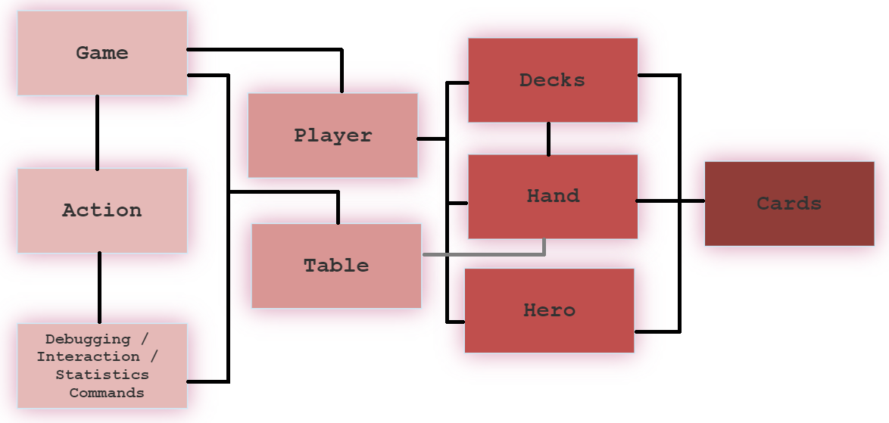
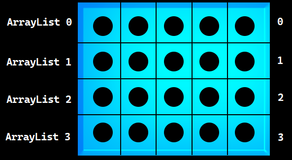
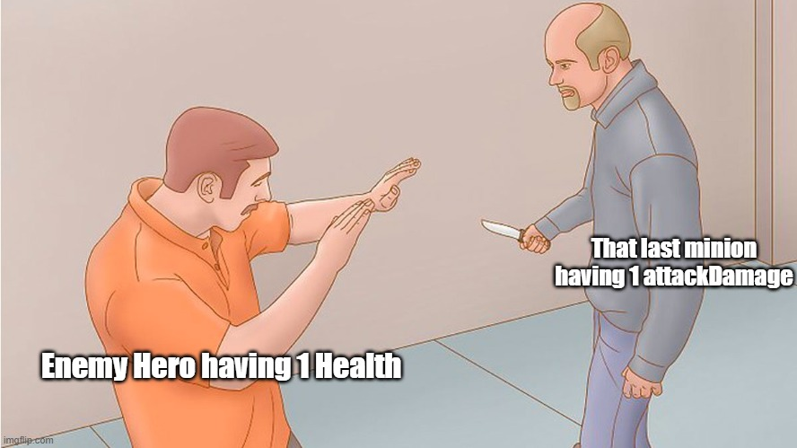

# Homework No. 1 - GwentStone

## Game Logic - Entry Point

> I thought of this game's implementation to be structured on classes that are
strongly linked to each other. The "fileio" classes were taken as a reference.
I used them to parse the input. The new created classes were related as in the
following flow chart:

> It starts with the entry point from Main. After that, the program iterates through
every game (*Game* class) of the respectively session. As every game has its events, they
are perceived as actions and sent to the *Action* class. Depending on the command,
the program is redirected to different command executioner classes. There is where
the entire game is happening, as the *Commands* classes are related to every class in part.

## Running Game

> Each two turns, a new round is instantiated. This approach is possible because of using
*turn* and *newRound* variables. The beginning of a new round is illustrated by
giving mana to players and allowing them to take a new card in hand.

> *turn* variable is usually used for receiving the index of the current player. So, parsing
the game as a parameter, the program may easily obtain the data from the wanted player.

> The constructor initialize this game parameters and copies data from input files.

## Cards

> There is a parent class named *Card*. Its children are represented by all the Minions,
Environment and Heroes cards existing. The best part of this approach is that there
may be used an *ArrayList<Card\>* for implementing *Decks* and *Hand*. This is possible
because of **Upcasting** (Parent p = new Child()).

> The *Card* class contains all the attributes and method signatures that a child class
could possibly need. So, if there is a need of featuring, **Overriding** will help
the program execute the action depending on the child method.

> There are two attributes: *type* and *specificType*. The *type* attribute specifies
the general breed of the card ("Minion", "Environment", "Hero"), while the *specificType*
is used for differentiate between Minions. For example, there are "BackMinion" (used for
back rows Minions), "FrontMinion" (used for front row Minions) and "FrontTankMinion" (used
for tank Minions).

## Processing Cards

> The process starts when the decks are shuffled in the *Player's* constructor, using
*Collections.shuffle*. After that, a player has access to two sets of cards, the cards
that he's keeping in *Hand* and the cards that are left beside, the *Decks*.

> At the beginning of every new round, there is a card taken from decks and transferred
to the player's hands set. After this part of the process, the card is available to
be used in the proper game.

> If wanted, a card from hands may be placed on the *Table*, which is built like a
4x5 matrix, using 4 ArrayLists of type *Card*. First 2 rows belongs to player no. 2,
while the last ones are mastered by the first player, as shown in the following picture:

> So, the coordinates are simply representing the card's position in the "Table matrix".

## Purpose

> The purpose of the game is simple. The enemy hero dies, you win! 

## Feedback
> Kudos for the people that have been involved in creating this homework.
I really enjoyed solving it. It helped me to understand better the concepts
of OOP and how Inheritance works or how classes may be linked to each other.

> The ideas of structuring this homework were great. The skel and team were
very helpful for me in implementing this game. I have received answers when
in need and the explanations that were given on the site were more than enough.

